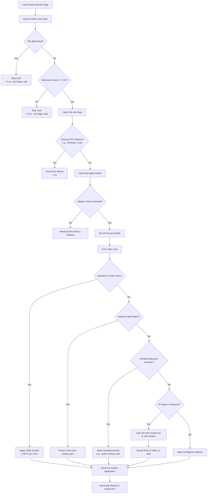

# EasyApply Automator

<div align="center">

[](https://www.python.org/downloads/)
[](tests/)
[](https://github.com/astral-sh/ruff)
[](http://mypy-lang.org/)
[](easy_apply_automator/qa/)
[](LICENSE)

**Next-generation, stealth AI automation engine and real-time control center for LinkedIn Easy Apply.**

[Key Features](#key-features) • [System Architecture](#system-architecture) • [Smart Decision Pipeline](#smart-decision-pipeline) • [Account Safety Guide](#linkedin-account-safety--anti-detection-guide) • [Quick Start](#quick-start) • [Control Center Dashboard](#live-web-dashboard--qa-studio) • [Configuration](#configuration-guide) • [Engineering Highlights](#engineering-highlights--interview-talking-points) • [FAQ](#troubleshooting--faq)

</div>

---

## Disclaimer

> **Educational & Research Purpose Only.**  
> LinkedIn's User Agreement strictly prohibits unauthorized automation, scraping, or botting. Use this software responsibly, ethically, and at your own discretion. The developers assume no liability for account warnings, restrictions, or suspensions resulting from automated activity. Review the [Account Safety Guide](#linkedin-account-safety--anti-detection-guide) below before running long sessions.

---

## Key Features

### 1. Resilient Job Discovery & SDUI Navigation Engine
* **Multi-Selector Card Discovery**: Scrapes job listings dynamically across varying LinkedIn search layouts (`data-job-id`, `data-occludable-job-id`, `div.job-card-container`, `li.jobs-search-results__list-item`, and regex `/jobs/view/(\d+)` anchor parsing). Resilient against LinkedIn A/B tests and DOM updates.
* **Server-Driven UI (SDUI) Support**: Seamlessly navigates both standard modal popups and LinkedIn's modern dedicated SDUI `/apply/?openSDUIApplyFlow=true` application pages.
* **Post-Navigation Synchronization**: Automatically detects full-page transitions, verifies DOM readiness, and scrolls into view before interacting with form components.
* **Direct Route Fallback**: Automatic recovery navigating directly to application endpoints when client-side trigger buttons fail to open modals.

### 2. Pre-Click Search Filtration & Heuristic Scoring
* **Sub-Millisecond Card Pre-Filter**: Reads job titles directly from search result cards before loading the job page. Blacklisted and irrelevant positions are skipped in under **0.1 seconds**, saving >90% bandwidth and session time.
* **Resume-Aligned Relevance Scorer**: High-throughput heuristic scoring engine (`RelevanceScorer`) matching 60+ technical skills (Python, Flask, Node.js, SQL, Data Scraping, Cybersecurity, SIEM, IT Support, AI/ML, NLP, QA Automation, Finance, SEO) while filtering out 40+ non-technical categories (sales, cold calling, marketing, non-English roles, manual labor).
* **Empty Page Fast Exit**: Detects consecutive empty pages and automatically skips redundant pagination to avoid burning rate limits on exhausted search combinations.

### 3. Multi-Tiered AI Question Answering & resume.md Integration
* **5-Stage Answer Resolution**:
  1. **Deterministic YAML Rules**: Instant regex match from `questions_answers.yaml` (0ms latency, zero API cost).
  2. **Dynamic Skill Years**: Extracts exact years from `profile.years` matching target keywords.
  3. **Contextual Recruitment Heuristics**: Handles standard questions (notice period, sponsorship, commute, relocation).
  4. **Zero-Shot LLM Reasoning**: Injects job metadata and full candidate `resume.md` into high-speed LLMs (Groq, Gemini, Claude, OpenAI, Ollama) for custom open-ended questions.
  5. **Safe Fallback**: Configurable fallback defaults ensuring forms are never left incomplete.
* **Self-Learning YAML Cache**: Answers generated by LLMs are automatically cached to local YAML storage on disk, turning future occurrences into zero-cost instant lookups.
* **Numeric Precision**: Preserves `0` and `0.0` values for years of experience without misrepresenting freshers or entry-level skills.
* **Prompt Injection Defense**: Sanitizes input questions, strips control characters, and wraps prompts in strict XML boundary tags.

### 4. Advanced Anti-Detection & Human Simulation
* **Cubic Bézier Mouse Trajectories**: Generates randomized Bézier curves with natural acceleration, deceleration, and human overshoot corrections instead of robotic straight-line movements.
* **Typing Cadence Jitter (`human_type_with_jitter`)**: Emulates human keystroke variance (20ms–65ms) and punctuation delays across all text inputs.
* **Smooth Scrolling & Reading Pauses**: Simulates natural user reading behavior before interacting with form sections.
* **Adaptive Circuit Breaker**: Detects consecutive failure spikes and triggers escalating cooldown intervals (60s, 120s, 180s up to 300s) to safeguard the account from detection.
* **Session Persistence**: Caches authentication cookies locally (`.auth/linkedin_cookies.json`), eliminating repeated 2FA or CAPTCHA challenges between runs.
* **Atomic Telemetry & Self-Healing Storage**: All results and logs use atomic write-and-replace (`.tmp` + rename), preventing data corruption on abrupt termination.

### 5. Real-Time Control Center & Historical Analytics Dashboard
* **Glassmorphic Single-Page Application**: Real-time Web Control Center running on Flask (`python dashboard.py`).
* **Date-Filtered Analytics**: Select specific calendar dates or session runs to view historical success rates, submission counts, and logs.
* **Interactive QA Studio**: Test recruiter questions in an in-browser sandbox to inspect resolved answers in real time.
* **YAML Rule & Profile Editor**: Modify skill experience years and add custom regex matching rules directly from the web interface.
* **Live Event Stream**: Real-time event stream (`logs/events.jsonl`) showing exactly what the bot is clicking and evaluating.

---

## LinkedIn Account Safety & Anti-Detection Guide

To protect your LinkedIn account from flags, checkpoints, or temporary restrictions, follow these best practices:

| Safety Practice | Recommended Setting / Behavior | Why It Matters |
| :--- | :--- | :--- |
| **Application Quotas** | `max_applications: 40-60` per day | Submitting hundreds of applications in a short span triggers automated spam filters. Keep daily totals reasonable. |
| **Pacing & Breaks** | `session_duration_hours_min: 2`<br>`session_duration_hours_max: 4`<br>`short_break_min_seconds: 15-45` | Natural pauses and short breaks every 30–60 minutes simulate human browsing patterns. |
| **Browser Visibility** | `headless: false` *(Keep UI visible)* | LinkedIn deploys sophisticated JavaScript fingerprinting to identify headless Chrome. Running with the browser visible looks like normal user traffic. |
| **Search Shuffling** | `shuffle_search_combos: true` | Prevents rigid, predictable search patterns by randomizing title and location queries. |
| **Working Hours** | Run during normal daytime hours (9 AM – 9 PM) | Continuous 24/7 automated activity is a primary signal for bot detection. |
| **Pre-Click Filtering** | Keep `blacklist_titles` and filters updated | Reduces the number of page loads by rejecting non-matching jobs before opening them. |

---

## System Architecture

```text
+-----------------------------------------------------------------------------------------+
|                                EasyApply Automator Core                                 |
+----------------------------+----------------------------+-------------------------------+
|     Application Layer      |       Services Layer       |     Infrastructure Layer      |
|  +----------------------+  |  +----------------------+  |  +-------------------------+  |
|  | Orchestrator /       |  |  | Apply Flow State     |  |  | Undetected ChromeDriver |  |
|  | Search Loop Engine   |--|  | Machine & ATS Gate   |--|  | Stealth Browser Engine  |  |
|  +----------------------+  |  +----------------------+  |  +-------------------------+  |
|             |              |             |              |               |               |
|  +----------------------+  |  +----------------------+  |  +-------------------------+  |
|  | Web Control Center   |  |  | Form Filler / SDUI   |  |  | Human Simulation:       |  |
|  | Dashboard (Flask)    |  |  | Navigation Handler   |  |  | Bézier Curves & Jitter   |  |
|  +----------------------+  |  +----------------------+  |  +-------------------------+  |
+-------------+----------------------------+------------------------------+---------------+
              |                            |                              |
    +-------------------+        +--------------------+        +---------------------+
    | questions_answers |        | Universal LLM API  |        | Atomic JSONL Logs & |
    | Local YAML Engine |        | Groq/Gemini/Claude |        | Session Cookies     |
    +-------------------+        +--------------------+        +---------------------+
```

### Directory Structure

```text
EasyApply-Automator/
├── config.yaml                    # Main search criteria, locations, filters, and pacing
├── resume.md                      # Candidate resume in Markdown (fed to LLM for zero-shot QA)
├── questions_answers.yaml         # Deterministic regex rules and skill experience profile
├── locators.yaml                  # Decoupled Page Object Model selectors for LinkedIn DOM
├── dashboard.py                   # Control Center Web Dashboard launcher
├── easy_apply_bot.py              # CLI entry point to launch automation
├── run.bat                        # Windows 1-Click interactive launcher
├── run.sh                         # Linux / macOS 1-Click interactive launcher
├── easy_apply_automator/
│   ├── app/                       # Runner, Orchestrator, Search Loop engine
│   ├── config/                    # YAML loaders and Pydantic configuration schemas
│   ├── dashboard/                 # Flask backend and single-page glassmorphic UI
│   ├── domain/                    # Clean dataclasses and business entity definitions
│   ├── infra/                     # Undetected ChromeDriver factory, Bézier math, repositories
│   ├── observability/             # Structured JSONL event logging and run summaries
│   ├── qa/                        # AutoAnswer engine, RelevanceScorer, universal LLM client
│   └── services/                  # Form filling, ATS redirect detection, session management
├── results/                       # Dated JSON results of processed, applied, and skipped jobs
└── tests/                         # 289 unit, integration, and mock tests
```

---

## Smart Decision Pipeline



---

## Quick Start

### Option 1: 1-Click Interactive Launcher (Recommended)

* **Windows**: Double-click **`run.bat`** (or execute `run.bat` in CMD / PowerShell).
* **Linux / macOS**: Run **`./run.sh`**.

The launcher handles environment initialization, displays the main menu, and prompts for your target role type:

```text
============================================
   EasyApply Automator - Control Center
============================================

Choose an option to run:
  [1] Start EasyApply Bot
  [2] Start Live Web Dashboard
  [3] Run Pytest Suite

Enter choice 1, 2, or 3 (default 1): 1

Select Target Role Type:
  [1] Internship Roles Only
  [2] Full-Time and Entry-Level Roles Only
  [3] Both (Default)

Enter choice 1, 2, or 3 (default 3): 3
```

### Option 2: Manual Setup via CLI

```bash
# 1. Clone the repository
git clone https://github.com/Romil157/EasyApply-Automator.git
cd EasyApply-Automator

# 2. Create and activate a Python 3.12 virtual environment
python -m venv venv
source venv/bin/activate       # Linux / macOS
venv\Scripts\activate          # Windows PowerShell / CMD

# 3. Install in editable mode with development dependencies
pip install -e ".[dev]"

# 4. Copy configuration templates
cp .env.example .env
cp questions_answers.example.yaml questions_answers.yaml

# 5. Populate your resume in Markdown format
# Place your updated resume content inside resume.md

# 6. Run the bot or launch the dashboard
python easy_apply_bot.py       # Start automation bot
python dashboard.py            # Launch Web Control Center on http://127.0.0.1:5000
```

---

## Live Web Dashboard & QA Studio

Launch the dashboard anytime to inspect ongoing sessions, review historical results by date, or simulate question answering:

```bash
python dashboard.py --port 5000
```

Open **`http://127.0.0.1:5000`** in your browser.

```text
==================================================
 EasyApply Automator Control Center
 Live Dashboard running at: http://127.0.0.1:5000
==================================================
```

### Dashboard Capabilities

* **Performance Overview with Date Filtering**:
  * Filter metrics across **All Time**, **Today**, or any specific calendar date.
  * Live KPI cards: Total Processed, Applications Submitted, Success Rate, and Session Logs.
* **Applied Jobs Explorer**:
  * Real-time table of all processed jobs with role title, company, submission status, and direct LinkedIn links.
  * Instant search and status filtering (Submitted vs. Skipped).
  * Date selector dropdown to isolate applications from a particular session.
* **Question Answering Studio**:
  * In-browser sandbox to test recruiter questions and preview how the bot answers them using YAML rules, skill years, or your LLM engine.
* **QA Rules & Profile Editor**:
  * Add, update, or remove regex matching rules directly from the browser without editing raw YAML files.
  * Adjust skill experience years (Python, SQL, AWS, Backend, etc.) with automatic persistence to disk.
* **Live Event Log**:
  * Real-time stream showing exact button clicks, page transitions, skipped jobs, and error diagnostics.

---

## Configuration Guide

EasyApply Automator uses a clean **3-layer configuration hierarchy**:

```text
+-------------------------------------------------------------+
| 1. config.yaml (Tracked)                                    |
|    Search positions, locations, filters & session pacing    |
+-------------------------------------------------------------+
| 2. .env (Gitignored)                                        |
|    Credentials, contact info & AI API keys (Groq/Gemini)   |
+-------------------------------------------------------------+
| 3. questions_answers.yaml & resume.md (Gitignored)          |
|    Skill years, custom regex rules & Markdown resume context|
+-------------------------------------------------------------+
```

### 1. `.env` (Secrets & Personal Profile)

Create `.env` from `.env.example`:

```env
# LinkedIn Credentials
LINKEDIN_USERNAME=your_email@example.com
LINKEDIN_PASSWORD=your_secure_password

# Contact Information (Auto-filled on initial form pages)
LINKEDIN_FULL_NAME=Your Full Name
LINKEDIN_FIRST_NAME=YourFirstName
LINKEDIN_LAST_NAME=YourLastName
LINKEDIN_EMAIL=your_email@example.com
LINKEDIN_PHONE_NUMBER=9876543210
LINKEDIN_LOCATION_COUNTRY=IN
LINKEDIN_LOCATION_CITY=Mumbai
LINKEDIN_SALARY=1000000

# AI Auto-Answer Engine (Groq, Gemini, OpenAI, Claude, or Ollama)
GROQ_API_KEY=gsk_your_groq_api_key_here
AI_PROVIDER=groq
AI_MODEL=openai/gpt-oss-120b
AI_AUTO_LEARN=1
```

### 2. `resume.md` (AI Context & Resume Integration)

Save your complete resume inside `resume.md` in standard Markdown format. When the bot encounters complex or role-specific questions (e.g., *"Describe a time you handled database migration"* or *"Summarize your experience with REST APIs"*), the LLM client injects `resume.md` along with the job posting description to generate authentic, context-aware answers.

### 3. `config.yaml` (Job Search & Runtime Parameters)

```yaml
# Target Roles
positions:
  - "Software Engineer"
  - "Python Developer"
  - "Backend Developer"
  - "Data Analyst"
  - "Cybersecurity Analyst"
  - "Financial Analyst"
  - "SEO Intern"

# Target Geographic Locations
locations:
  - Mumbai
  - Remote
  - India
  - Bengaluru

# Workplace Preferences
workplace_types:
  - remote
  - hybrid
  - onsite

# Experience Levels: 1=Internship, 2=Entry Level, 3=Associate, 4=Mid-Senior
experience_level:
  - 1
  - 2

# Maximum applications per session (0 = unlimited)
max_applications: 50

# Resume mapping for file upload prompts
uploads:
  Resume: "resume.md"

# Stealth Session Pacing
session_duration_hours_min: 2
session_duration_hours_max: 4
short_break_min_seconds: 15
short_break_max_seconds: 45
short_break_every_min_minutes: 30
short_break_every_max_minutes: 60
shuffle_search_combos: true

# Runtime Flags
dry_run: false
headless: false
```

### 4. `questions_answers.yaml` (Rules & Skill Profiles)

```yaml
version: 1

defaults:
  unknown_years: "0"
  unknown_text: "user provided"
  yes: "Yes"
  no: "No"

profile:
  years:
    python: "2"
    sql: "2"
    flask: "2"
    backend: "2"
    machine_learning: "1"
    cybersecurity: "2"
  work_auth:
    require_sponsorship: "No"
    legally_authorized: "Yes"

rules:
  - id: python_experience
    match_any:
      - "(?i)years of python"
      - "(?i)experience with python"
    answer: "{years.python}"

  - id: notice_period
    match_any:
      - "(?i)notice period"
      - "(?i)joining time"
    answer: "Immediate / 15 days"
```

---

## CLI Flags & Advanced Commands

Customize any execution on the fly using command-line arguments:

```bash
# Filter target role types (1=Internship, 2=Full-Time & Entry, 3=Both)
python easy_apply_bot.py --level 1

# Run in test mode without actually submitting forms
python easy_apply_bot.py --dry-run

# Run in headless mode (no Chrome window opened)
python easy_apply_bot.py --headless

# Filter jobs posted within the last 24 hours
python easy_apply_bot.py --date-posted past_24h

# Filter strictly for Remote positions
python easy_apply_bot.py --remote-only

# Cap maximum submitted applications for the current run
python easy_apply_bot.py --max-apps 30

# Specify custom configuration or QA paths
python easy_apply_bot.py --config my_config.yaml --qa my_qa.yaml
```

---

## Engineering Highlights & Interview Talking Points

If showcasing this project in technical evaluations, code reviews, or software engineering interviews, highlight these architectural decisions:

1. **Domain-Driven Design (DDD) & Clean Architecture**:
   * Pure domain dataclasses (`AppConfig`, `RunConfig`, `JobMetadata`) separated strictly from infrastructure, browser drivers, and presentation layers.
2. **Anti-Fingerprinting & Natural Physics**:
   * Uses `undetected-chromedriver` combined with randomized cubic Bézier curves to simulate human cursor velocity and overshoot physics.
3. **Pre-Click Filtration Pipeline**:
   * Evaluates job card titles directly from search pages, eliminating full page loads for blacklisted or irrelevant roles in under 0.1 seconds.
4. **Decoupled Page Object Model (`locators.yaml`)**:
   * All CSS and XPath selectors are decoupled into an external YAML registry. DOM restructuring requires zero Python code edits.
5. **Universal Multi-Provider AI Architecture**:
   * Built on a lightweight, native REST client supporting Groq, Gemini, Claude, OpenAI, and local Ollama without heavy third-party SDK bloat.
6. **Zero-Leak PII Protection**:
   * Credentials, phone numbers, and resumes are strictly gitignored via `.env` and `resume.md`, preventing sensitive personal data leaks.
7. **Atomic Persistence & Self-Healing Telemetry**:
   * Application outputs employ atomic temporary file swaps (`.tmp` + `replace()`), preventing JSON file corruption from unexpected halts (`Ctrl+C`).
8. **Self-Learning Cache Architecture**:
   * Dynamically appends novel answers generated by AI into local YAML rules, driving marginal API costs down to zero as the rule set expands.

---

## Troubleshooting & FAQ

### 1. Chrome Version & Driver Initialization
* **Symptom**: `SessionNotCreatedException` or Chrome driver startup timeout.
* **Fix**: Ensure Google Chrome is up to date (`chrome://settings/help`). The bot uses `undetected-chromedriver` which auto-downloads matching drivers. If an issue occurs, clear cached driver binaries from your temporary folder (`%TEMP%` on Windows).

### 2. Daily Easy Apply Limit Checkpoint
* **Symptom**: LinkedIn displays *"You've reached today's Easy Apply limit"*.
* **Fix**: LinkedIn enforces rolling daily limits (typically 50–100 applications every 24 hours). The bot's limit detector intercepts this modal, records the event cleanly, and halts the session gracefully. Resume your session the following day.

### 3. Login Checkpoints & 2FA Challenges
* **Symptom**: LinkedIn presents an SMS verification code, email challenge, or CAPTCHA during login.
* **Fix**: Run the bot with `headless: false`. Complete the verification manually once in the opened Chrome browser. The session service will automatically serialize and save authentication cookies to `.auth/linkedin_cookies.json`, allowing subsequent sessions to bypass verification.

### 4. Preserving Session Data on Shutdown
* **Symptom**: Need to exit a running session cleanly.
* **Fix**: Press `Ctrl+C` **once**. The bot enters graceful termination, finishes the current operation, flushes pending JSON logs, and saves updated cookies before shutting down. Pressing `Ctrl+C` a second time forces an immediate termination.

---

## Testing & Quality Assurance

The codebase is protected by **289 automated tests** covering unit behavior, integration paths, and mock browser flows:

```bash
# Run the full test suite with coverage report
python -m pytest tests/ -v --cov=easy_apply_automator --cov-report=term-missing

# Run code style formatting and lint checks
python -m ruff check .

# Execute static type checking
python -m mypy easy_apply_automator
```

---

## License

Distributed under the **MIT License**. See [`LICENSE`](LICENSE) for complete terms.
