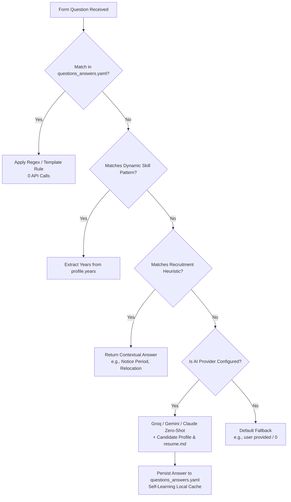

# EasyApply Automator

<div align="center">

[](https://www.python.org/downloads/)
[](LICENSE)
[](tests/)
[](https://github.com/astral-sh/ruff)
[](http://mypy-lang.org/)
[](easy_apply_automator/qa/)

**Next-generation, stealth, AI-powered automation engine and real-time control center for LinkedIn Easy Apply.**

[Key Features](#key-features) • [System Architecture](#system-architecture) • [Decision Waterfall](#smart-qa-decision-waterfall) • [Quick Start](#quick-start) • [Web Dashboard](#live-web-dashboard--qa-studio) • [Configuration](#configuration) • [Engineering Highlights](#engineering-decisions--presentation-highlights)

</div>

---

## Disclaimer

> **Educational & Research Purpose Only.**  
> LinkedIn's User Agreement strictly prohibits unauthorized automation, scraping, or botting. Use this software responsibly and at your own risk. The developers assume no liability for account warnings, restrictions, or suspensions resulting from automated activity.

---

## Key Features

### 1. AI Zero-Shot Question Answering & Self-Learning Cache
* **Multi-Provider AI Client**: Native REST client supporting **Groq** (`openai/gpt-oss-120b`, `llama-3.3-70b`), **Google Gemini Flash**, **OpenAI**, **Anthropic Claude**, and **local Ollama** without bulky SDK dependencies.
* **Resume & Profile Injection**: Automatically injects candidate skills, work experience, education, authorization status, and `resume.md` into zero-shot prompts for high-context answers.
* **Self-Learning Local Cache**: When AI resolves an unknown question, it dynamically appends the rule into your local `questions_answers.yaml` on disk. Future occurrences are resolved locally with **zero API calls and zero latency**.

### 2. Anti-Detection & Human Simulation
* **Cubic Bezier Mouse Trajectories**: Generates randomized cubic Bezier cursor paths with human velocity profiles and subtle overshoot corrections instead of robotic straight-line jumps.
* **Typing Jitter (`human_type_with_jitter`)**: Emulates human typing cadence with variable inter-keystroke intervals (20ms–65ms) and natural punctuation pauses.
* **Natural Smooth Scrolling & Reading Pauses**: Injects multi-step eased scrolling and realistic 1s–2s page reading pauses before interacting with application forms.
* **Adaptive Circuit Breaker**: Real-time stall and challenge detection that triggers an automated 60-second cooldown on consecutive stalls to protect accounts from rate limiting.
* **Stealth Chrome Flags**: Built-in `--disable-blink-features=AutomationControlled` to evade heuristic bot detection.

### 3. Live Web Dashboard & In-Browser QA Studio
* **Glassmorphic Single-Page Application**: Real-time control center (`python dashboard.py`) featuring live KPI streaming (Applications Submitted, Failed, Jobs Evaluated, Submission Rate).
* **Processed Jobs Explorer**: Search, filter, and inspect detailed submission statuses, company names, job titles, and failure diagnostics.
* **Live Event Stream Monitor**: Real-time telemetry feed streaming internal bot events directly from `logs/events.jsonl`.
* **Interactive Question Answering Studio**: In-browser sandbox allowing you to test any recruiter question to preview the exact answer the bot and AI engine will select.

### 4. React 18 & Server-Driven UI (SDUI) Resilience
* **Multi-Modal Synthetic Click Dispatcher**: Dispatches synthetic `PointerEvent` + `MouseEvent` event chains and tab-focus switching to trigger React 18 event listeners reliably.
* **Direct `/apply/` Fallback**: Detects modern SDUI modal slide-sheets and falls back to direct `/jobs/view/{job_id}/apply/` URL navigation when button clicks fail.
* **Smart Form Auto-Recovery**: Automatically resolves unselected comboboxes, typeahead dropdowns, and required legal/privacy checkboxes.

---

## System Architecture

```text
┌──────────────────────────────────────────────────────────────────────────────────┐
│                             EasyApply Automator Core                             │
├──────────────────────────┬──────────────────────────┬────────────────────────────┤
│   Application Layer      │     Services Layer       │   Infrastructure Layer     │
│  ┌────────────────────┐  │  ┌────────────────────┐  │  ┌──────────────────────┐  │
│  │ Orchestrator /     │  │  │ Apply Flow State   │  │  │ Undetected Browser   │  │
│  │ Search Loop        │─│  │ Machine            │─│  │ Factory (Chrome)     │  │
│  └────────────────────┘  │  └────────────────────┘  │  └──────────────────────┘  │
│            │             │            │             │            │               │
│                         │                         │                           │
│  ┌────────────────────┐  │  ┌────────────────────┐  │  ┌──────────────────────┐  │
│  │ Live Control       │  │  │ Form Filler /      │  │  │ Human Simulation:    │  │
│  │ Dashboard Server   │  │  │ SDUI Recovery      │  │  │ Bezier & Jitter      │  │
│  └────────────────────┘  │  └────────────────────┘  │  └──────────────────────┘  │
└────────────┬──────────────────────────┬──────────────────────────┬───────────────┘
                                                                 
   ┌───────────────────┐      ┌───────────────────┐      ┌───────────────────┐
   │ questions_answers │      │ Groq / Gemini /   │      │ JSONL Telemetry & │
   │ Local YAML Rules  │      │ Claude LLM Engine │      │ Cookie Repository │
   └───────────────────┘      └───────────────────┘      └───────────────────┘
```

---

## Smart QA Decision Waterfall

When encountering form questions, the bot executes a 4-tier decision waterfall:



---

## Quick Start

### Option 1: One-Click Interactive Launcher
* **Windows**: Double-click **`run.bat`** (or run `run.bat` in CMD).
* **Linux / macOS**: Run **`./run.sh`**.

The launcher provides an interactive menu:
```text
============================================
   EasyApply Automator - Control Center
============================================

Choose an option to run:
  [1] Start EasyApply Bot
  [2] Start Live Web Dashboard
  [3] Run Pytest Suite

Enter choice 1, 2, or 3 (default 1):
```

### Option 2: Manual Installation & CLI
```bash
# 1. Clone the repository
git clone https://github.com/Romil157/EasyApply-Automator.git
cd EasyApply-Automator

# 2. Set up virtual environment
python -m venv venv
source venv/bin/activate  # Linux / macOS
venv\Scripts\activate     # Windows

# 3. Install in editable mode with dev dependencies
pip install -e ".[dev]"

# 4. Copy configuration templates
cp .env.example .env
cp questions_answers.example.yaml questions_answers.yaml

# 5. Start the bot or web dashboard
python easy_apply_bot.py      # Run LinkedIn bot
python dashboard.py           # Launch Web Control Center on http://127.0.0.1:5000
```

---

## Live Web Dashboard & QA Studio

Launch the dashboard at any time to monitor your applications or test QA rules:
```bash
python dashboard.py --port 5000
```

```text
==================================================
 EasyApply Automator Control Center
 Live Dashboard running at: http://127.0.0.1:5000
==================================================
```

### Dashboard Capabilities:
* **Real-Time KPIs**: Total evaluated jobs, successful submissions, failure rates, and live pacing speed.
* **Applications Table**: Searchable history of applied jobs with direct links, timestamps, and error diagnostics.
* **Live Event Stream**: Real-time event log viewer updating automatically as the bot navigates.
* **QA Testing Studio**: Type any arbitrary recruiter question into the in-browser sandbox to preview the resolved answer.

---

## Configuration

EasyApply Automator follows a clean **3-layer configuration architecture**:

```text
┌─────────────────────────────────────────────────────────────┐
│ 1. config.yaml (Tracked)                                    │
│    Search positions, locations, filters & date range        │
├─────────────────────────────────────────────────────────────┤
│ 2. .env (Gitignored)                                        │
│    Credentials, phone, email, API keys (Groq/Gemini)        │
├─────────────────────────────────────────────────────────────┤
│ 3. questions_answers.yaml & resume.md (Gitignored)          │
│    Candidate experience years, custom rules, resume text    │
└─────────────────────────────────────────────────────────────┘
```

### 1. `.env` (Secrets & Personal Data)
Copy `.env.example` to `.env` and fill in your details:

```env
# LinkedIn Credentials
LINKEDIN_USERNAME=your_email@example.com
LINKEDIN_PASSWORD=

# Personal Info Auto-filled in Forms
LINKEDIN_FULL_NAME=Your Full Name
LINKEDIN_FIRST_NAME=Your First Name
LINKEDIN_LAST_NAME=Your Last Name
LINKEDIN_EMAIL=your_email@example.com
LINKEDIN_PHONE_NUMBER=1234567890
LINKEDIN_LOCATION_COUNTRY=IN
LINKEDIN_LOCATION_CITY=Mumbai
LINKEDIN_SALARY=1000000

# AI / LLM Auto-Answer Engine (Groq / Gemini / OpenAI)
GROQ_API_KEY=gsk_your_groq_api_key_here
AI_PROVIDER=groq
AI_MODEL=openai/gpt-oss-120b
AI_AUTO_LEARN=1
```

### 2. `config.yaml` (Job Search & Criteria)
```yaml
positions:
  - Software Engineer
  - Python Developer
  - Data Engineer

locations:
  - Remote
  - India

filters:
  database_related:
    - "oracle"
    - "mongodb"
  medical_related:
    - "healthcare"
    - "clinical"

# Numeric experience level codes:
# 1: Entry level | 2: Associate | 3: Mid-Senior | 6: Internship
experience_level:
  - 1
  - 2
  - 6
```

### 3. `questions_answers.yaml` (Answer Profile & Rules)
```yaml
version: 1

defaults:
  unknown_years: "0"
  unknown_text: "user provided"
  yes: "Yes"
  no: "No"

profile:
  years:
    python: "2"
    sql: "1"
    backend: "2"
    machine_learning: "1"
  work_auth:
    require_sponsorship: "No"
    legally_authorized: "Yes"

rules:
  - id: python_experience
    match_any:
      - "(?i)years of python"
      - "(?i)experience with python"
    answer: "{years.python}"

  - id: sponsorship
    match_any:
      - "(?i)require sponsorship"
      - "(?i)need visa sponsorship"
    answer: "{require_sponsorship}"
```

---

## CLI Flags & Options

The bot supports command-line flags to customize any session on the fly:

```bash
# Run in headless mode without opening Chrome UI
python easy_apply_bot.py --headless

# Test search and form-filling without actually clicking Submit
python easy_apply_bot.py --dry-run

# Filter only jobs posted within the last 24 hours
python easy_apply_bot.py --date-posted past_24h

# Filter only Remote jobs
python easy_apply_bot.py --remote-only

# Limit the maximum applications for this session
python easy_apply_bot.py --max-apps 25
```

---

## Engineering Decisions & Presentation Highlights

If showcasing this project in technical reviews or interviews, highlight these core design decisions:

1. **Domain-Driven Design (DDD) & Layered Separation**:
   - `domain/`: Pure dataclasses (`AppConfig`, `RunConfig`, `JobMetadata`).
   - `infra/`: Browser automation factory, Bezier trajectory generator, repositories.
   - `qa/`: AutoAnswer pattern matching and universal REST LLM client.
   - `services/`: Business logic, state machines, and SDUI form handlers.
   - `dashboard/`: Flask control center and REST streaming.
2. **Anti-Fingerprinting & Behavioral Simulation**:
   - Uses `undetected-chromedriver` with overridden Chrome `cdc_` properties and cubic Bezier curves to emulate human cursor physics.
3. **Decoupled Page Object Model (`locators.yaml`)**:
   - HTML selectors are externalized into `locators.yaml`. UI updates on LinkedIn require **zero code changes**.
4. **Hybrid PII Protection**:
   - High-sensitivity data (credentials, phone, name, email) is isolated into `.env` and `resume.md` (gitignored), ensuring no personal data is committed to source control.
5. **Self-Learning QA Architecture**:
   - Combines deterministic regex rules with zero-shot LLM reasoning and auto-persisting cache for efficient, cost-free answer reuse.

---

## Testing & Quality Assurance

The codebase is tested with unit and mock-based tests:

```bash
# Run full pytest suite with coverage
python -m pytest tests/ -v --cov=easy_apply_automator --cov-report=term-missing

# Linting with Ruff
python -m ruff check .

# Static type checking with Mypy
python -m mypy easy_apply_automator
```

Continuous Integration (`.github/workflows/ci.yml`) runs tests, type checking, and linter validation on every push.

---

## License

Distributed under the **MIT License**. See [`LICENSE`](LICENSE) for more information.
